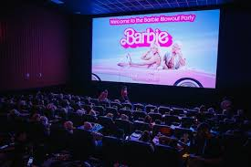
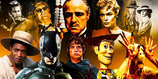
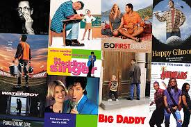

# 517-simon-movies
I like movies and they are always better with popcorn

# Movies

I like to watch movies with my family. We like to watch comedy. What do you enjoy?

- comedy
- horror
- action
- thriller
- sci-fi
- romance

## Movie Theatres

The popularity of movie theatres comes and goes. With tech advancement, you can watch movies at home with the whole family for only $5! Wow!

Movie Theatres by Popularity:

1. AMC
2. The one in Fenton
3. IMax at the marbles kids museum
4. Airplane (it's like a movie theatre in the sky)

## Actors

I have a favorite actor. He is a director too. His movies are either really loved or very much disliked. The rotten tomato reviews inform my family on what we know we'll like watching the most. The worst ratings are the best!

### [Adam Sandler](https://en.wikipedia.org/wiki/Adam_Sandler)

This is the actor I like. He is one of the highest wealth actors in the world (if not the most). Adam Sandler is an icon, a legend, and a funny guy. He is seen in Saturday Night Live from back in the day, and makes cameo appearances sometimes.

### To Popcorn or Not?

I don't know about you, but I love [popcorn](https://en.wikipedia.org/wiki/Popcorn). My dad and I make it fresh in our whirlypop on the stovetop. Add some salt, butter, and put it in a big mixing bowl, and you've got a happy family night!

I don't know about you, but I love popcorn. My dad and I make it fresh in our whirlypop on the stovetop. Add some salt, butter, and put it in a big mixing bowl, and you've got a happy family night!

- So Popcorn?
- Or Not?

*Hoping this popcorn pic makes you hungry*